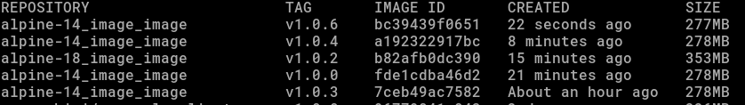
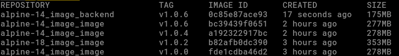
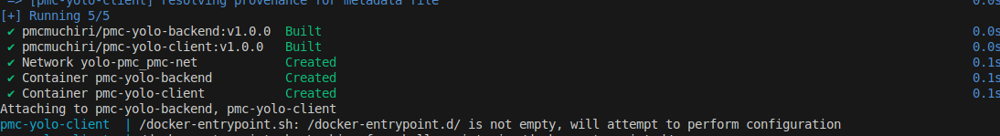
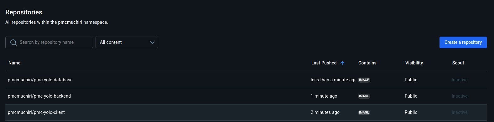

# YOLO E-Commerce App(yolomy)

## About Application
A full-stack e-commerce platform built using the MERN stack `(MongoDB, Express.js, React, and Node.js)`, featuring fashion and clothing products.
This project demonstrates containerized microservices for the frontend, backend, and database using Docker and Docker Compose.

## Getting Started
Follow these steps to set up and run the YOLO E-Commerce App locally using Docker.
### Prerequisites
Make sure you have the following installed:

- [Docker](https://www.docker.com/get-started)

- [Docker compose](https://docs.docker.com/compose/install/)

- [Git](https://git-scm.com/)

### Clone the Repository

```bash
# Clone the repository
git clone https://github.com/pmc-muchiri/yolo.git

# Navigate into the project folder
cd yolo
```
### Create and Configure Environment Variables
Create a .env file in the project root or rename `.env.sample`

## Features
- Modular microservice structure (frontend, backend, database)
- Fully orcharstrated with `Docker` and `Docker Compose`
- MongoDB database integration
- Lightweight images and production-ready (Alpine-based)
- Secure environment variable management with `.env` file. a `.env.sample` file is provide

## Project Structure

```bash
yolo/
    ├─ backend/             
    │   └── Dockerfile
    ├─ client/              
    │   └── Dockerfile
    ├─ database/            
    │   └── Dockerfile
    ├─ docker-compose.yaml  
    ├─ .env                 
    └─ docs/
        └── images/
```          

## Step by Step Builing Containers
### Frontend Container
Build and test the frontend image  and test using this command

```bash
 docker image build -t alpine_image_image:v1.0.0 client/
 ```

You can verify using:

```bash
 docker images
 ```


    
Expected: The image builds successfully.

### BackEnd dockerfile

Create dockerfile and test using this command

``` docker image build -t alpine_image_image:v1.0.0 backend/```


    
after building confirm the image that has been built as well.

``` docker images ```


    
Using multi-stage builds with alpine base reduces the final image size significantly.

### Database Dockerfile
    A lightweight MongoDB database container built from a custom Dockerfile.
    


### 2 Docker-compose file
Create docker-compose.yaml (compose.yml)

Step 1: Set up your first microservice (database container using MongoDB).
- Use MongoDB image version 3.0 as your base image.
- Configure authentication credentials (username and password) via an external .env file.
- Bind the service port to the host using `2017:2017`
- Create a custom Docker network and connect the MongoDB container to it.
- Set up a storage by creating a volume and attaching it to the MongoDB container to preserve data across restarts.

Step 2: Create the Backend Container
- Tag the image with a suitable name and version, for example: `pmcmuchiri/pmc-yolo-client:v1.0.0`
- Specify the build path, such as `/backend`
- Run interactively which is optional (docker run -it)
- Attach the container to the previously created network to enable communication with other services. 



### Running the Application

Once all Dockerfiles are ready, start the services with:

```bash
 docker-compose up --build 
 ```

To run in detached mode:

```bash
docker-compose up -d 
```

### Stop and Clean Up
To stop running containers:

```bash
docker compose down
```

To remove containers, networks, and volumes:

```bash
docker compose down -v
```

### FInal Images 
Here are the final images less than 400mbs


Then visit Frontend -> [Yolo Website](http://localhost:8080) and upload your product.

### Dockerhub Images 
These are the images that I pyshed to dockerhub


You can view, pull, or use these images directly from my Docker Hub repository: [Dockerhub-pmcmuchiri](https://hub.docker.com/repositories/pmcmuchiri)


## Product Upload on the website


## Application Architecture
```bash
        +------------------+
        |     CLIENT       |
        |  React Frontend  |
        |  (Port: 8080)    |
        +--------+---------+
                 |
                 | HTTP (localhost/)
                 v
        +-------------------+
        |    BACKEND        |
        | Express + Node.js |
        |  (Port: 5000)     |
        +--------+----------+
                 |
                 | MongoDB URI
                 v
        +-------------------+
        |   DATABASE        |
        |   MongoDB (3.0)   |
        |  (Port: 27017)    |
        +-------------------+
```

## Author
[Paul Muchiri](https://github.com/pmc-muchiri) 

Repo Forked from [Yolo](https://github.com/Vinge1718/yolo)
