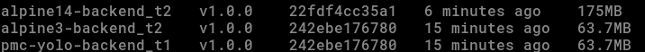

# YOLO E-Commerce App(yolomy)
Updated Documentation Overview

 [Frontend Access:http://34.35.137.242/](http://34.35.137.242)

This documentation is organized into four main stages, representing the progressive automation and deployment journey of the YOLO E-Commerce application:

1. **Containerized Orchestration with Docker**
- Focuses on building and managing the YOLO microservices (frontend, backend, and database) using Docker and Docker Compose.

2. **Automated Provisioning with Ansible and Vagrant**
- Covers full infrastructure automation and environment setup using Vagrant for virtualization and Ansible for configuration management and container deployment.

- A full-stack e-commerce platform built using the MERN stack `(MongoDB, Express.js, React, and Node.js)`, featuring fashion and clothing products.
- This project demonstrates containerized microservices for the frontend, backend, and database using Docker and Docker Compose.

3. **Infrastructure Provisioning with Terraform and Ansible**
- Combines Terraform for resource provisioning and Ansible for post-deployment configuration, achieving end-to-end automation.

4. **Kubernetes Deployment**
- Covers deploying your microservices in a Kubernetes cluster, including Services, StatefulSets, and Ingress.

## 1. Containerized Orchestration with Docker
## Getting Started
Follow these steps to set up and run the YOLO E-Commerce App locally using Docker.
### Prerequisites
Make sure you have the following installed:

- [Docker](https://www.docker.com/get-started)

- [Docker compose](https://docs.docker.com/compose/install/)

- [Git](https://git-scm.com/)

### Clone the Repository

```bash
# Clone the repository
git clone https://github.com/pmc-muchiri/yolo.git

# Navigate into the project folder
cd yolo
```
### Create and Configure Environment Variables
Create a .env file in the project root or rename `.env.sample`

## Features
- Modular microservice structure (frontend, backend, database)
- Fully orcharstrated with `Docker` and `Docker Compose`
- MongoDB database integration
- Lightweight images and production-ready (Alpine-based)
- Secure environment variable management with `.env` file. a `.env.sample` file is provide

## Project Structure

```bash
yolo/
    ├─ backend/             
    │   └── Dockerfile
    ├─ client/              
    │   └── Dockerfile
    ├─ database/            
    │   └── Dockerfile
    ├─ docker-compose.yaml  
    ├─ .env                 
    └─ docs/
        └── images/
```          

## Step by Step Builing Containers
### Frontend Container
Build and test the frontend image  and test using this command

```bash
 docker image build -t alpine_image_image:v1.0.0 client/
 ```

You can verify using:

```bash
 docker images
 ```


    
Expected: The image builds successfully.

### BackEnd dockerfile

Create dockerfile and test using this command

``` docker image build -t alpine_image_image:v1.0.0 backend/```


    
after building confirm the image that has been built as well.

``` docker images ```


    
Using multi-stage builds with alpine base reduces the final image size significantly.

### Database Dockerfile

A lightweight MongoDB database container built from a custom Dockerfile.
    


### 2 Docker-compose file
Create docker-compose.yaml (compose.yml)

Step 1: Set up your first microservice (database container using MongoDB).
- Use MongoDB image version 3.0 as your base image.
- Configure authentication credentials (username and password) via an external .env file.
- Bind the service port to the host using `2017:2017`
- Create a custom Docker network and connect the MongoDB container to it.
- Set up a storage by creating a volume and attaching it to the MongoDB container to preserve data across restarts.

Step 2: Create the Backend Container
- Tag the image with a suitable name and version, for example: `pmcmuchiri/pmc-yolo-client:v1.0.0`
- Specify the build path, such as `/backend`
- Run interactively which is optional (docker run -it)
- Attach the container to the previously created network to enable communication with other services. 


### Running the Application

Once all Dockerfiles are ready, start the services with:

```bash
 docker-compose up --build 
 ```

To run in detached mode:

```bash
docker-compose up -d 
```

### Stop and Clean Up
To stop running containers:

```bash
docker compose down
```

To remove containers, networks, and volumes:

```bash
docker compose down -v
```

### FInal Images 
Here are the final images less than 400mbs


Then visit Frontend -> [Yolo Website](http://localhost:8080) and upload your product.

### Dockerhub Images 
These are the images that I pyshed to dockerhub


You can view, pull, or use these images directly from my Docker Hub repository: [Dockerhub-pmcmuchiri](https://hub.docker.com/repositories/pmcmuchiri)


## Product Upload on the website


## Application Architecture
```bash
        +------------------+
        |     CLIENT       |
        |  React Frontend  |
        |  (Port: 8080)    |
        +--------+---------+
                 |
                 | HTTP (localhost/)
                 v
        +-------------------+
        |    BACKEND        |
        | Express + Node.js |
        |  (Port: 5000)     |
        +--------+----------+
                 |
                 | MongoDB URI
                 v
        +-------------------+
        |   DATABASE        |
        |   MongoDB (3.0)   |
        |  (Port: 27017)    |
        +-------------------+
```

# 2. Automated Provisioning with Ansible and Vagrant

To simplify deployment and ensure environment consistency, I have integrated Ansible and Vagrant for full automation of the Dockerized YOLO app.

## How It Works

- Vagrant provisions an Ubuntu geerlingguy/ubuntu2004 virtual machine (VM) using VirtualBox.

- Once the VM is created, Ansible automatically:
    - Installs Docker and required dependencies.
    - Pulls the following pre-built Docker images from Docker Hub
        - frontend. 
        - backend.
        - database.
    - Creates and connects the necessary Docker networks.
    - Runs the containers with proper port mappings.

## Containers Deployed

|       Service       | Image                                         | Port Mapping          |
|---------------------| ----------------------------------------------| ----------------------|
|       Frontend      | `pmcmuchiri/pmc-yolo-client:v1.0.1`           | `8080:80`             |
|       Backend       | `pmcmuchiri/pmc-yolo-backend:v1.0.1`          | `5000:5000`           |
|       Database      | `pmcmuchiri/pmc-yolo-database:v1.0.1`         | `27017:27017`         |

## Folder Structure
```bash
ansible/
├── inventory.yml             
├── playbook.yml              
├── vars/
│   └── all.yml               
└── roles
        ├── backend
        │   └── tasks
        │       └── main.yml
        ├── common
        │   └── tasks
        │       └── main.yml
        ├── db
        │   └── tasks
        │       └── main.yml
        └── frontend
        └── tasks
                └── main.yml
            
Vagrantfile                   
```
### inventory.yml
- Here I defines the Ansible inventory.
    - specifies the host(s) Ansible connects to.
    - In this setup, it points to the Vagrant VM running locally over SSH.
    - It tells Ansible where to execute tasks.

### playbook.yml
- The entry point for Ansible automation.
- Defines which hosts to target and which roles to execute in sequence.

### vars/all.yml
- Central configuration file for environment variables and container settings.
- Contains definitions like:
    - Docker image names and tags

    - Container ports

    - Network names

    - MongoDB credentials

    - Application base paths
- Itkeeps configuration declarative, centralised, and easily adjustable without touching playbooks.

### Roles
- Roles divide automation into modular components, each responsible for one layer of the stack.

1. common/ : Handles system setup and prerequisites.

 Tasks include:

  - Updating packages and installing Docker, git, and curl

  - Adding the vagrant user to the Docker group

  - Cloning the application repository

  - Creating Docker networks for service communication

  - It prepares the base environment shared by all services.

2. db/

- Manages the MongoDB container.

- Key tasks:

    - Pulls MongoDB image from Docker Hub

    - Ensures a persistent data volume exists

    - Runs the MongoDB container with authentication and port mapping
    
    - It sets up the database layer.

3. backend/

- Deploys the Node.js/Express API service.

- Key tasks:

    - Creates the backend directory

    - Pulls the backend image from Docker Hub

    - Runs the backend container, linking it to both database and frontend networks

    - Exposes port 5000

4. frontend/

- Manages the React frontend container (served via Nginx).

- Key tasks:

    - Pulls the prebuilt frontend image

    - Runs the container, exposing it on port 80

    - Connects it to the frontend-backend-net network

### Vagrantfile

- Defines the virtual machine configuration for the deployment environment.

- Creates a consistent, reproducible environment for the entire stack — from OS setup to running containers.


## Setting Up the Environment

**Step 1: Clone the Repository**
```bash

git clone https://github.com/pmc-muchiri/yolo

cd yolo

```

**Step 2: Start the Virtual Machine**

```bash

vagrant up

```

This command:

- Spins up an Ubuntu **geerlingguy/ubuntu2004** VM.

- Automatically runs Ansible to:

- Install Docker & dependencies.

- Create app directories and Docker networks.

- Pull prebuilt Docker images from Docker Hub.

- Run all containers with proper environment variables and ports.


Once provisioning is complete ssh into the vm using this command
```bash

vagrant ssh

```


Then Run this command

```bash

Docker ps

```


## Test Connection
Test connection inside VM using this command

```bash

curl localhost

```
This is the expected outcome if it’s working


## Access the app from your host machine:
- Frontend → http://localhost:8080

## Cleanup Commands

To stop all containers:

```bash

docker compose down

```
To destroy the VM completely:

```bash

vagrant destroy -f

```

To reprovision a fresh setup:

```bash

vagrant up --provision

```
# 4. Kubernetes (k8s) — Deployment on GKE

### Overview
This final stage involves deploying the YOLO e-commerce microservices to **Google Kubernetes Engine (GKE)**.  
The stack includes:
- **MongoDB ReplicaSet** (3 nodes)
- **Backend (Node.js/Express)** exposed via LoadBalancer
- **Frontend (React + Nginx)** exposed via LoadBalancer

---

### Live URL
Frontend → [http://34.35.137.242/](http://34.35.137.242/)  
Backend → `http://34.35.131.113:5000`

---

### Docker Images Used
- `docker.io/pmcmuchiri/pmc-yolo-frontend:v1.0.2`
- `docker.io/pmcmuchiri/pmc-yolo-backend:v1.0.2`
- `docker.io/pmcmuchiri/pmc-yolo-database:v1.0.1`

---


### Kubernetes Cluster Creation

Before deploying microservices, you need to log in, list your projects, and create a cluster.

1. Login to Google Cloud
```bash
gcloud auth login
```
This opens a browser window to authenticate your account.


2. List available projects

```bash
gcloud projects list
```
Note the PROJECT_ID you want to use for your YOLO cluster.
mine:


3. Set your project

```bash

gcloud config set project pmc-yolo-k8s

```


4. Create the Kubernetes cluster

```yml
gcloud container clusters create yolo-cluster \
  --zone africa-south1-a \
  --num-nodes 2 \
  --machine-type e2-medium
```


5. Get cluster credentials

```bash
 gcloud container clusters get-credentials yolo-cluster --zone africa-south1-a --project pmc-yolo-k8s
```


6. Verify the cluster is running

```bash
kubectl get nodes
```


### Deploying on GKE

```bash
# Deploy all Kubernetes manifests
kubectl apply -f k8s/ -n yolo

# Check pods
kubectl get pods -n yolo
```


### MongoDB ReplicaSet Initialization
After the Mongo/database pods are ready, open a shell to one of them and run:

```bash
kubectl exec -it mongo-0 -n yolo -- mongosh -u root -p pmc123
```
and inside mongo shell execute the following:

```yaml

rs.initiate({
  _id: "rs0",
  members: [
    { _id: 0, host: "mongo-0.mongo.yolo.svc.cluster.local:27017" },
    { _id: 1, host: "mongo-1.mongo.yolo.svc.cluster.local:27017" },
    { _id: 2, host: "mongo-2.mongo.yolo.svc.cluster.local:27017" }
  ]
})
```

and you should see the following when you check status

```yaml

{
  "ok" : 1,
  "operationTime" : ...
}
```

### check backend connection

Check logs:

```bash
kubectl logs deploy/yolo-backend -n yolo
```

and this is what you are expected to see

```bash
Database connected successfully
Server running on port 5000
```


## Checking Services

Once your Kubernetes resources are deployed, verify that all services are running and properly connected by executing:

```bash
kubectl get svc -n yolo
```
This command lists all Kubernetes Services within the yolo namespace.

## Ingress Testing & Verification

Once the Ingress resource has been created and assigned an external IP, confirm that it’s reachable.

**1. Watch for the External IP**

```bash
kubectl get ingress -n yolo --watch
```


When you see an address appear, note it down. for example: `34.54.82.149`

**2. Verify Access via Custom Domain**

Edit your local /etc/hosts file to map the Ingress IP to your app’s domain by eunning this:
```bash
sudo nano /etc/hosts

```
Map the Ingress IP:

```yaml

127.0.0.1 localhost
127.0.1.1 muchiri
34.54.82.149   yolo-app.pmcdevops.com
# The following lines are desirable for IPv6 capable hosts
::1     ip6-localhost ip6-loopback
fe00::0 ip6-localnet
ff00::0 ip6-mcastprefix
ff02::1 ip6-allnodes
ff02::2 ip6-allrouters

```

Test the Connection
Ping to verify network reachability:

```bash

ping yolo-app.pmcdevops.com

```

open in your browser:

[http://yolo-app.pmcdevops.com](http://yolo-app.pmcdevops.com)

You should see your YOLO frontend or landing page load successfully


## Accessing the Application
Once all pods and LoadBalancers are active:

Frontend--> http://34.35.137.242/


Backend --> http://34.35.131.113:5000/api/products

## google cloud Screenshots

**Project**


**Cluster**


## System Archi

```markdown

                 ┌───────────────┐
                 │ Users/Clients │
                 └───────┬───────┘
                         │ HTTP
                         ^
                ┌────────────────────────┐
                │        Ingress         │
                │ yolo-app.pmcdevops.com │
                └───────┬────────────────┘
                        │
           ┌────────────┴────────────┐
           │                         │
    ┌───────────────┐         ┌───────────────┐
    │    Frontend   │         │ Backend       │
    │    Service    │         │ Service       │
    └───────────────┘         └───────────────┘
            │                         │
            │                         │
            ^                         |
       ┌─────────────┐                |
       │ Database    │                |
       │ (MongoDB)   │  <─────────────        
       └─────────────┘          
```

## Author
[Paul Muchiri](https://github.com/pmc-muchiri) 
DevOps Engineer | Cloud & Automation Enthusiast


*Repository forked and enhanced from [Yolo](https://github.com/Vinge1718/yolo)*
